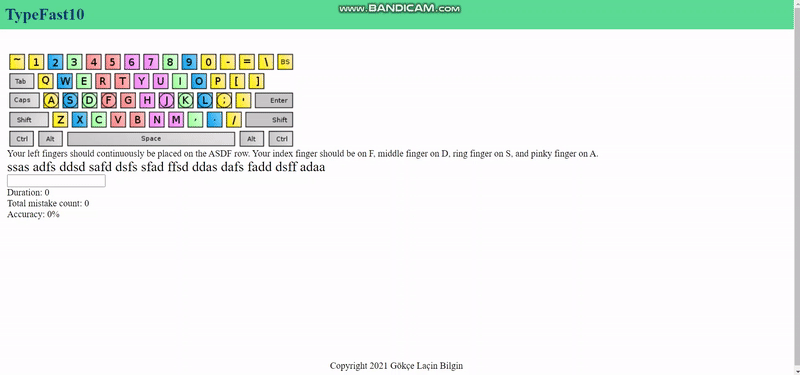

# typefast10

## Project setup
```
npm install
```

### Compiles and hot-reloads for development
```
npm run serve
```

### Compiles and minifies for production
```
npm run build
```

### Lints and fixes files
```
npm run lint
```

### Customize configuration
See [Configuration Reference](https://cli.vuejs.org/config/).

<hr>

### Description

__typefast10__ is an application that aims to teach users to write fast using 10 fingers. I created this typefast10 with Vue.js framework, aiming to familiarize myself with it.

Aside from the indispensable word generation and typing functionalities, the app has an analysis functionality (which is its own separate component).

Below is a gif showing how the app currently looks (I haven't done any styling yet so bare with me).



Below are the explanations of key features:

### How word generation and display works:

For the first level, random letters are generated from 'asdf' combinations. When the user hits the correct key, the corresponding letters on screen turn green, and in the contrary, when they hit the wrong key, the corresponding letters' background is painted red.

### How typing works:

Nothing happens insided the input box when you type correct or wrong letters unless you complete writing one word correctly, after which your input dissappears. In this way you can't go back and delete the words you've already completed correctly.

### How analysis works:

Analysis takes data from Word and Typing components and processes those data to produce various analyses. This component includes a straight-forward duration, mistakes count and accuracy calculation and other in-depth analysis including 1) which letter you mistyped instead of which letter, 2) which letter you mistyped following which letter, and 3) how many seconds it took you to write one specific word.


## Remarks

As you can probably tell, this is an incomplete version of what I have in mind. For example, I am planning on adding a recorder of the input box for improving the analysis feature, and perhaps a graph. And I think I'll do the styling once I complete the logic I currently have in mind.